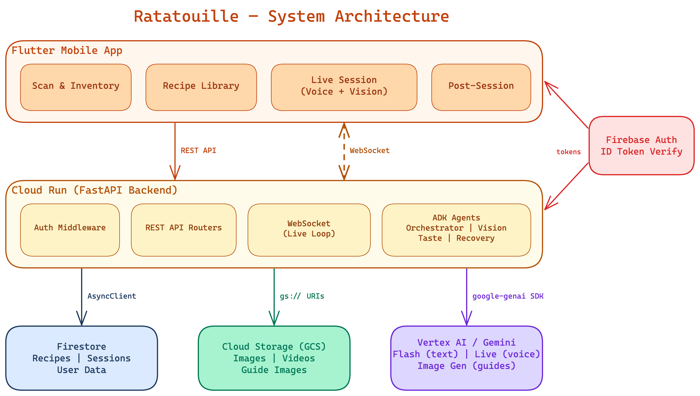
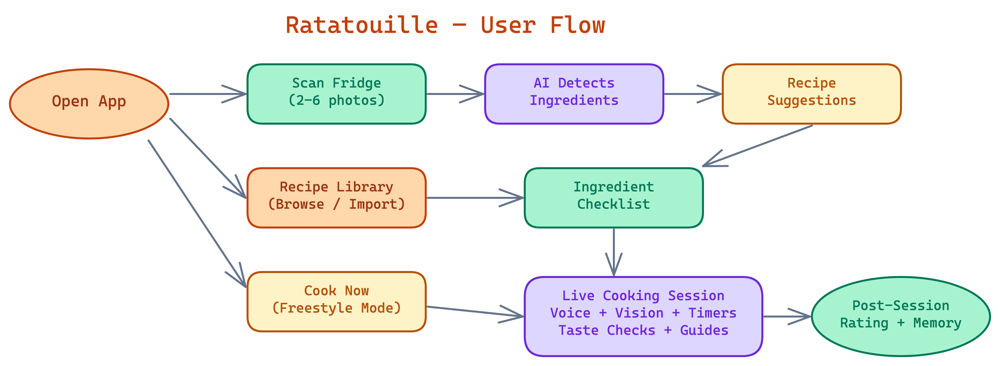
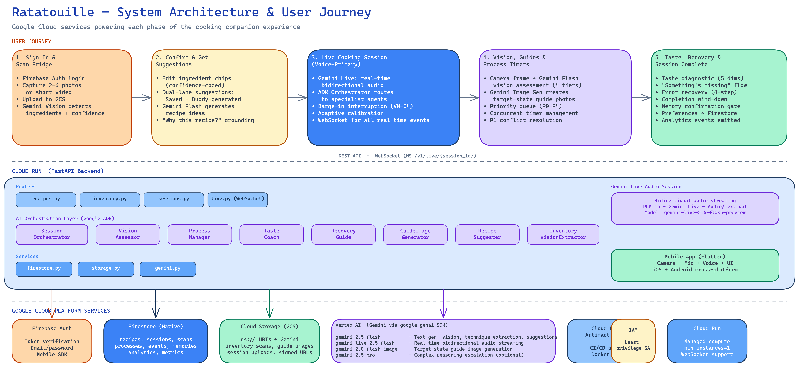

# Ratatouille — Live Cooking Companion

A real-time, multimodal cooking companion powered by **Google Cloud** and **Gemini AI**. Ratatouille watches what you're cooking and adapts guidance in real time through voice, vision, and timing context.

Built for the **Gemini Live Agent Challenge** hackathon.

## Contributors

| Name | Role |
|------|------|
| **Karthik Srinivasan** | Full-stack development, backend architecture, AI integration |
| **Nevetha Balasubramanian** | Full-stack development, mobile UX, product design |

## Architecture



The system follows a three-tier architecture:

- **Flutter Mobile App** — Cross-platform client with scan, recipe library, live session, and post-session flows
- **FastAPI Backend on Cloud Run** — REST API + WebSocket endpoints, ADK agent orchestration, auth middleware
- **Google Cloud Services** — Firestore (data), Cloud Storage (media), Vertex AI / Gemini (intelligence), Firebase Auth (identity)

## User Flow



Three entry points converge on the live cooking session:

1. **Scan Path** — Photograph your fridge/pantry, AI detects ingredients, get recipe suggestions, pick one, confirm ingredients, start cooking
2. **Recipe Library Path** — Browse saved recipes or import from URL, confirm ingredients, start cooking
3. **Freestyle Path** — Tap "Cook Now" for zero-setup coaching with no recipe required

## Features

### Fridge/Pantry Scan & Smart Suggestions
- Upload 2-6 images or a short video of your fridge
- Gemini detects ingredients with confidence scores
- Dual-lane recipe suggestions: matching saved recipes + AI-generated ideas
- "Why this recipe?" grounded explanations based on your available ingredients

### Recipe Library
- Create, import (from URL), browse, and manage recipes
- Automatic technique tag extraction (saute, deglaze, braise, etc.)
- Ingredient normalization for consistent matching
- Sort by recently used, fastest, or difficulty

### Live Cooking Session (Voice + Vision)
- **Voice-primary interaction** with natural barge-in (interrupt the buddy mid-sentence)
- **Vision checks** — point your camera at the food for doneness assessment
- **AI-generated visual guides** — see what your dish *should* look like at each stage
- **Process management** — track multiple parallel tasks with priority-based timers
- **Error recovery** — immediate action, honest assessment, concrete path forward

### Seasoned Chef Buddy (Freestyle Mode)
- Zero-setup: tap "Cook Now" and start in under 30 seconds
- No saved recipe required — the buddy adapts in real time
- Full voice loop, vision checks, and process management

### Post-Session
- Difficulty rating and verbal send-off
- Memory confirmation: approve what the buddy learned about your preferences
- Session event logging for observability

## Google Cloud Services & User Journey



*Google Cloud services powering each phase of the cooking companion experience — from sign-in through live session to post-session analytics.*

## Google Cloud Services Used

| Service | Purpose | Details |
|---------|---------|---------|
| **Vertex AI (Gemini)** | AI intelligence | `gemini-2.0-flash` for text/vision, `gemini-2.0-flash-live-001` for real-time voice+vision, image generation for visual guides |
| **Cloud Firestore** | Database | Recipes, sessions, inventory scans, user preferences, event logs. AsyncClient for non-blocking FastAPI |
| **Cloud Storage (GCS)** | Media storage | Fridge photos, session uploads, AI-generated guide images. Direct `gs://` URI integration with Gemini |
| **Cloud Run** | Backend hosting | Containerized FastAPI with auto-scaling, WebSocket support, min-instances=1 for demo reliability |
| **Firebase Auth** | Authentication | Anonymous sign-in for hackathon demo, ID token verification on all protected endpoints |
| **Cloud Build** | CI/CD | Docker build, push to Artifact Registry, deploy to Cloud Run |
| **Artifact Registry** | Container registry | Docker image storage for Cloud Run deployments |

## Tech Stack

### Backend
- **Python 3.11** + **FastAPI** — async everywhere
- **Google ADK** — agent orchestration (Orchestrator, Vision, Taste, Recovery agents)
- **google-genai** — Vertex AI / Gemini client
- **Pydantic v2** — request/response validation
- **firebase-admin** — server-side token verification

### Mobile
- **Flutter** — cross-platform (Android + iOS)
- **Provider** — state management
- **go_router** — declarative routing
- **web_socket_channel** — real-time communication
- **Firebase Auth SDK** — client-side authentication

## Project Structure

```
ratatouille/
├── backend/
│   ├── app/
│   │   ├── main.py              # FastAPI app, middleware, router mount
│   │   ├── config.py            # Environment config
│   │   ├── auth/firebase.py     # Token verification dependency
│   │   ├── routers/             # REST + WebSocket endpoints
│   │   ├── agents/              # ADK agents (orchestrator, vision, taste, etc.)
│   │   ├── services/            # Firestore, GCS, Gemini clients
│   │   └── models/              # Pydantic models
│   ├── Dockerfile
│   ├── requirements.txt
│   └── cloudbuild.yaml
├── mobile/
│   ├── lib/
│   │   ├── app/                 # App shell, routing, theming
│   │   ├── core/                # API client, auth, WebSocket, env config
│   │   ├── features/            # scan, recipes, live_session, etc.
│   │   └── shared/              # Reusable widgets
│   ├── pubspec.yaml
│   └── .env
├── diagrams/                    # Architecture & flow diagrams
├── epics/                       # Epic specs with tasks & acceptance criteria
└── CLAUDE.md                    # Project conventions
```

## Getting Started

### Prerequisites
- Python 3.11+
- Flutter 3.16+
- Google Cloud SDK (`gcloud`)
- A GCP project with Firestore, Vertex AI, and Firebase Auth enabled

### Backend (Local)

```bash
cd backend

# Create virtual environment
python3 -m venv .venv
source .venv/bin/activate

# Install dependencies
pip install -r requirements.txt

# Configure environment
cp .env.example .env
# Edit .env with your GCP project details

# Authenticate with GCP
gcloud auth application-default login

# Run locally
uvicorn app.main:app --host 0.0.0.0 --port 8000 --reload
```

### Mobile

```bash
cd mobile

# Configure environment
cp .env.example .env
# Edit .env: set BACKEND_URL and Firebase config

# Install dependencies
flutter pub get

# Run on device/emulator
flutter run
```

### Deploy to Cloud Run

```bash
cd backend
gcloud builds submit --config=cloudbuild.yaml
```

Then update `mobile/.env` with the Cloud Run service URL.

## API Endpoints

| Method | Path | Purpose |
|--------|------|---------|
| `POST` | `/v1/recipes` | Create recipe |
| `GET` | `/v1/recipes` | List user's recipes |
| `GET` | `/v1/recipes/{id}` | Get single recipe |
| `PUT` | `/v1/recipes/{id}` | Update recipe |
| `DELETE` | `/v1/recipes/{id}` | Delete recipe |
| `POST` | `/v1/recipes/from-url` | Import recipe from URL |
| `POST` | `/v1/inventory-scans` | Upload scan images |
| `POST` | `/v1/inventory-scans/{id}/detect` | Run ingredient detection |
| `GET` | `/v1/inventory-scans/{id}/suggestions` | Get recipe suggestions |
| `POST` | `/v1/sessions` | Create cooking session |
| `POST` | `/v1/sessions/{id}/activate` | Start live session |
| `WS` | `/v1/live/{session_id}` | WebSocket for real-time voice/vision |

## License

MIT
