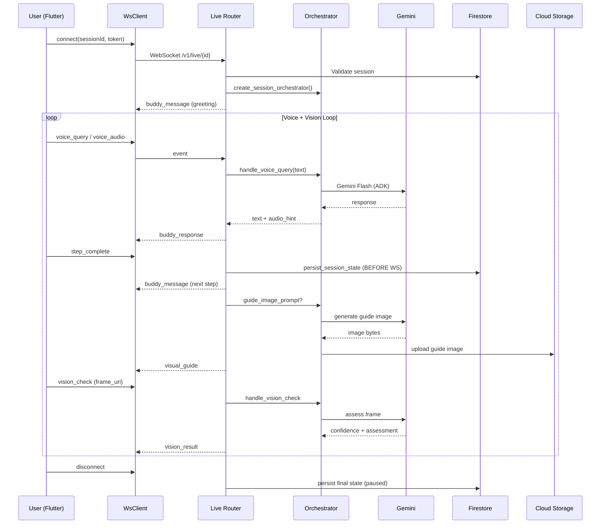
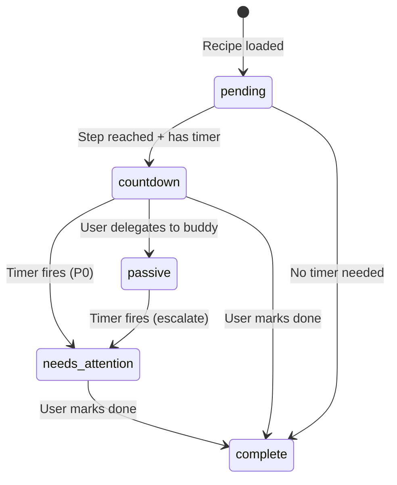

# Ratatouille Architecture Diagram

## System Architecture (Mermaid)

```mermaid
graph TB
    subgraph "Mobile Client (Flutter)"
        UI[App Shell / Router]
        Scan[Scan Feature]
        Recipes[Recipe Library]
        Live[Live Session Screen]
        Post[Post-Session]
        WS[WsClient]
        API[ApiClient]
        Auth[AuthService]
        Camera[CameraService]
        Audio[AudioCapture / Playback]
        Conn[ConnectivityService]
    end

    subgraph "Backend (FastAPI on Cloud Run)"
        Main[main.py / Middleware]
        R_Recipe[Recipe Router]
        R_Scan[Scan Router]
        R_Session[Session Router]
        R_Live[Live WS Router]
        R_Post[Post-Session Router]

        subgraph "ADK Agents"
            Orch[Session Orchestrator]
            Vision[Vision Assessor]
            Taste[Taste Checker]
            Recovery[Recovery Agent]
            Guide[Guide Image Generator]
        end

        subgraph "Services"
            FS[Firestore Service]
            GCS[Storage Service]
            Gemini[Gemini Client]
            Analytics[Analytics]
            Browse[Browse Session]
            Timers[Timer System]
            Processes[Process Manager]
        end
    end

    subgraph "Google Cloud"
        Firestore[(Firestore)]
        Storage[(Cloud Storage)]
        VertexAI[Vertex AI / Gemini]
        FireAuth[Firebase Auth]
        CloudRun[Cloud Run]
        ArtifactReg[Artifact Registry]
        CloudBuild[Cloud Build]
    end

    %% Mobile to Backend
    UI --> Scan
    UI --> Recipes
    UI --> Live
    UI --> Post
    Live --> WS
    Live --> Camera
    Live --> Audio
    Live --> Conn
    Scan --> API
    Recipes --> API
    Post --> API
    API --> Auth
    WS --> Auth

    %% Backend routing
    API -->|REST| Main
    WS -->|WebSocket| Main
    Main --> R_Recipe
    Main --> R_Scan
    Main --> R_Session
    Main --> R_Live
    Main --> R_Post

    %% Router to agents/services
    R_Live --> Orch
    Orch --> Vision
    Orch --> Taste
    Orch --> Recovery
    Orch --> Guide
    R_Live --> Timers
    R_Live --> Processes
    R_Scan --> Browse

    %% Services to GCP
    FS --> Firestore
    GCS --> Storage
    Gemini --> VertexAI
    Auth --> FireAuth
    Main -->|Deployed on| CloudRun
    CloudBuild --> ArtifactReg
    ArtifactReg --> CloudRun

    %% Agent to services
    Orch --> Gemini
    Vision --> Gemini
    Taste --> Gemini
    Recovery --> Gemini
    Guide --> Gemini
    Guide --> GCS
    R_Recipe --> FS
    R_Scan --> FS
    R_Scan --> GCS
    R_Session --> FS
    R_Post --> FS
    Browse --> Gemini

    classDef gcp fill:#4285F4,stroke:#333,color:#fff
    classDef agent fill:#34A853,stroke:#333,color:#fff
    classDef service fill:#FBBC04,stroke:#333,color:#000
    classDef mobile fill:#EA4335,stroke:#333,color:#fff

    class Firestore,Storage,VertexAI,FireAuth,CloudRun,ArtifactReg,CloudBuild gcp
    class Orch,Vision,Taste,Recovery,Guide agent
    class FS,GCS,Gemini,Analytics,Browse,Timers,Processes service
    class UI,Scan,Recipes,Live,Post,WS,API,Auth,Camera,Audio,Conn mobile
```

## Data Flow: Live Cooking Session

```mermaid
sequenceDiagram
    participant U as User (Flutter)
    participant WS as WsClient
    participant LR as Live Router
    participant O as Orchestrator
    participant G as Gemini
    participant FS as Firestore
    participant GCS as Cloud Storage

    U->>WS: connect(sessionId, token)
    WS->>LR: WebSocket /v1/live/{id}
    LR->>FS: Validate session
    LR->>O: create_session_orchestrator()
    LR-->>WS: buddy_message (greeting)

    loop Voice + Vision Loop
        U->>WS: voice_query / voice_audio
        WS->>LR: event
        LR->>O: handle_voice_query(text)
        O->>G: Gemini Flash (ADK)
        G-->>O: response
        O-->>LR: text + audio_hint
        LR-->>WS: buddy_response

        U->>WS: step_complete
        LR->>FS: persist_session_state (BEFORE WS)
        LR-->>WS: buddy_message (next step)
        LR->>O: guide_image_prompt?
        O->>G: generate guide image
        G-->>O: image bytes
        O->>GCS: upload guide image
        LR-->>WS: visual_guide

        U->>WS: vision_check (frame_uri)
        LR->>O: handle_vision_check
        O->>G: assess frame
        G-->>O: confidence + assessment
        LR-->>WS: vision_result
    end

    U->>WS: disconnect
    LR->>FS: persist final state (paused)
```

## Process Management Flow

```mermaid
stateDiagram-v2
    [*] --> pending: Recipe loaded
    pending --> countdown: Step reached + has timer
    countdown --> needs_attention: Timer fires (P0)
    countdown --> passive: User delegates to buddy
    passive --> needs_attention: Timer fires (escalate)
    needs_attention --> complete: User marks done
    countdown --> complete: User marks done
    pending --> complete: No timer needed
```
